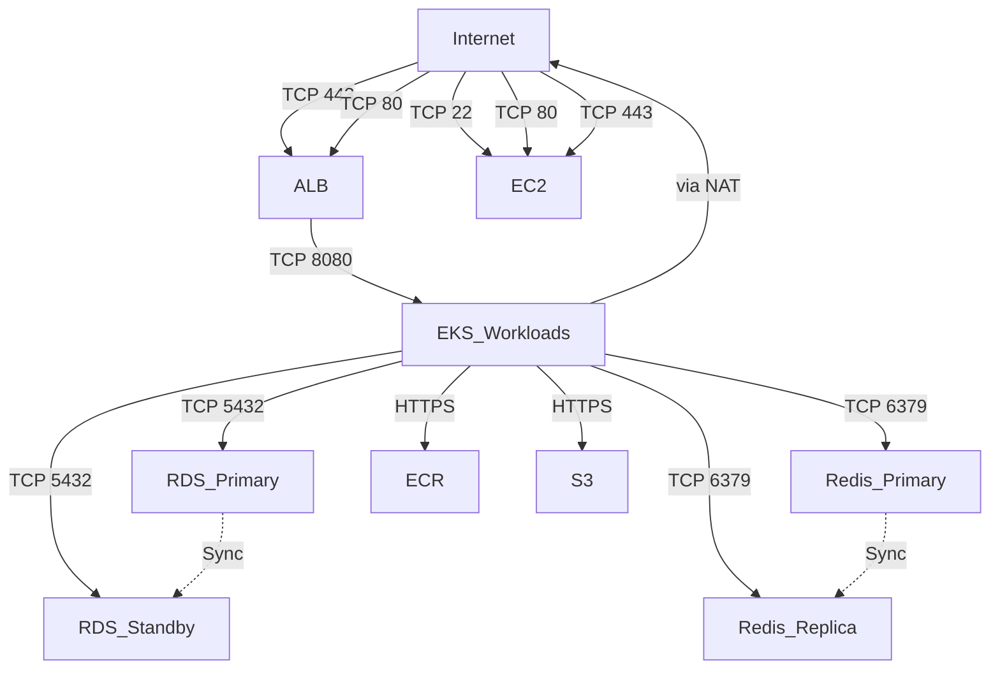

# Staging Option 2 + Production + Shared Multi-AZ

## Architecture Overview

This environment deploys a complete AWS infrastructure architecture combining:
- **Staging Option 2**: Amazon EC2 instance (t4g.large, 2 vCPU, 8 GB RAM, ARM64) with VPC networking
- **Production**: Amazon EKS cluster with 2 worker nodes (t3.xlarge, 4 vCPU, 16 GB RAM)
- **Shared Infrastructure Multi-AZ**: RDS PostgreSQL (db.t3.medium) and Redis (cache.t4g.medium) with automatic failover across multiple availability zones
- **Supporting Services**: ALB, S3, ECR, VPC networking

This configuration provides a flexible staging environment using EC2 with full VPC networking while maintaining a production-grade EKS platform with high-availability Multi-AZ shared infrastructure for database and caching services.

## Complete AWS Service Inventory

| AWS Service | Purpose | Configuration | AZ Model |
|------------|---------|---------------|----------|
| Amazon EC2 | Staging compute | t4g.large (2 vCPU, 8 GB RAM), ARM64, 30 GB gp3 | Single-AZ |
| Amazon EKS | Production compute/orchestration | 1 cluster, 2× t3.xlarge nodes (4 vCPU, 16 GB RAM) | Multi-AZ nodes |
| ALB | Application ingress | Standard ALB, HTTP/HTTPS termination | Multi-AZ |
| RDS PostgreSQL | Production database | db.t3.medium, 100 GB gp3 | Multi-AZ |
| Redis/Valkey | Production cache | cache.t4g.medium (Primary + Replica) | Multi-AZ |
| ECR | Container registry | Private registry, ~20 GB images | Regional |
| S3 | Object storage | Standard storage, ~10 GB | Regional |
| VPC | Networking | Custom VPC with public/private/database subnets | Multi-AZ |
| NAT Gateway | Private subnet egress | Single NAT Gateway | Single-AZ |
| EC2 EBS | Block storage | 30 GB gp3 for EC2, 2× 100 GB gp3 for EKS nodes | Multi-AZ |

## Exact Instance Sizes

### Staging EC2
- **Instance Type**: t4g.large
- **vCPU**: 2
- **RAM**: 8 GB
- **Storage**: 30 GB gp3
- **Architecture**: ARM64

### Production EKS Worker Nodes
- **Instance Type**: t3.xlarge
- **vCPU**: 4
- **RAM**: 16 GB
- **Storage**: 100 GB gp3 per node (2 nodes total)
- **Architecture**: x86_64

### RDS PostgreSQL
- **Instance Type**: db.t3.medium
- **vCPU**: 2
- **RAM**: 4 GB
- **Storage**: 100 GB gp3
- **Multi-AZ**: Primary + Standby replica

### Redis
- **Instance Type**: cache.t4g.medium
- **vCPU**: 2
- **RAM**: 3.08 GB
- **Architecture**: ARM64
- **Multi-AZ**: Primary + Replica with automatic failover

## Exact Storage Sizes

- **EC2**: 30 GB gp3
- **EKS Worker Nodes**: 2 × 100 GB gp3 = 200 GB total
- **RDS PostgreSQL**: 100 GB gp3 (same for standby)
- **S3**: Approximately 10 GB
- **ECR**: Approximately 20 GB container images

## Network Topology

### VPC Configuration
- **VPC CIDR**: 10.0.0.0/16 (configurable)
- **Availability Zones**: 2 AZs (Multi-AZ architecture)
- **Public Subnets**: 10.0.0.0/24, 10.0.1.0/24
- **Private Subnets**: 10.0.2.0/24, 10.0.3.0/24
- **Database Subnets**: 10.0.4.0/24, 10.0.5.0/24

### Route Tables
- **Public Route Table**: Routes 0.0.0.0/0 to Internet Gateway
- **Private Route Table**: Routes 0.0.0.0/0 to NAT Gateway
- **Database Route Table**: Routes 0.0.0.0/0 to NAT Gateway

### Internet Gateway
- **1 Internet Gateway**: Provides internet access for public subnets
- **1 NAT Gateway**: Provides outbound internet access for private subnets

## Network Ports

### Security Group Matrix

| Security Group | Direction | Protocol | Port | Source/Destination | Reason |
|----------------|-----------|----------|------|-------------------|--------|
| EC2 SG | Inbound | TCP | 22 | Variable (default 0.0.0.0/0) | SSH access |
| EC2 SG | Inbound | TCP | 80 | 0.0.0.0/0 | HTTP |
| EC2 SG | Inbound | TCP | 443 | 0.0.0.0/0 | HTTPS |
| ALB SG | Inbound | TCP | 80 | 0.0.0.0/0 | HTTP from internet |
| ALB SG | Inbound | TCP | 443 | 0.0.0.0/0 | HTTPS from internet |
| EKS Cluster SG | Inbound | TCP | 1025-65535 | VPC CIDR | Node communication |
| EKS Node SG | Inbound | TCP | 1025-65535 | EKS Cluster SG | Cluster communication |
| EKS Node SG | Inbound | All | All | EKS Node SG | Node-to-node |
| RDS SG | Inbound | TCP | 5432 | EKS Node SG | PostgreSQL |
| Redis SG | Inbound | TCP | 6379 | EKS Node SG | Redis |
| All SGs | Outbound | All | All | 0.0.0.0/0 | Outbound internet |

### Network Flow Diagram



### Port Documentation

**Port 80 (HTTP)**
- **Protocol**: TCP
- **Source**: Internet
- **Destination**: ALB, EC2
- **Purpose**: Web traffic
- **Public/Private**: Public
- **Security Group**: ALB SG, EC2 SG
- **Required For**: HTTP web traffic

**Port 443 (HTTPS)**
- **Protocol**: TCP
- **Source**: Internet
- **Destination**: ALB, EC2
- **Purpose**: Secure web traffic
- **Public/Private**: Public
- **Security Group**: ALB SG, EC2 SG
- **Required For**: HTTPS web traffic

**Port 22 (SSH)**
- **Protocol**: TCP
- **Source**: Configurable CIDR (default 0.0.0.0/0)
- **Destination**: EC2
- **Purpose**: Server administration
- **Public/Private**: Public
- **Security Group**: EC2 SG
- **Required For**: Server management
- **Recommendation**: Restrict to specific IP ranges in production

**Port 5432 (PostgreSQL)**
- **Protocol**: TCP
- **Source**: EKS Node SG
- **Destination**: RDS PostgreSQL
- **Purpose**: Database communication
- **Public/Private**: Private
- **Security Group**: RDS SG
- **Required For**: Application database access

**Port 6379 (Redis)**
- **Protocol**: TCP
- **Source**: EKS Node SG
- **Destination**: Redis
- **Purpose**: Cache communication
- **Public/Private**: Private
- **Security Group**: Redis SG
- **Required For**: Application cache access

**Port 1025-65535 (Ephemeral)**
- **Protocol**: TCP
- **Source**: VPC CIDR
- **Destination**: EKS Cluster, EKS Nodes
- **Purpose**: Kubernetes communication
- **Public/Private**: Private
- **Security Group**: EKS Cluster SG, EKS Node SG
- **Required For**: EKS cluster operations

## Security Architecture

### Network Security

**Public vs Private Subnets**
- **Public Subnets**: Host ALB and EC2 with direct internet access
- **Private Subnets**: Host EKS worker nodes without direct internet access
- **Database Subnets**: Host RDS and Redis with enhanced isolation

**Route Tables**
- **Public Routes**: Internet traffic → Internet Gateway
- **Private Routes**: Internet traffic → NAT Gateway
- **Database Routes**: Internet traffic → NAT Gateway

**NAT Gateway**
- **Single NAT Gateway**: Provides outbound internet access for private resources
- **Cost Consideration**: NAT Gateway has hourly charges + data processing fees
- **High Availability**: Single-AZ deployment (no redundancy)

**Security Groups**
- **Principle of Least Privilege**: Only required ports are open
- **Source Restrictions**: Database access restricted to EKS nodes only
- **SSH Restriction**: Configurable CIDR for SSH access
- **Outbound Rules**: All resources can reach internet for software updates

### IAM Security

**IAM Roles**
- **EKS Cluster Role**: AmazonEKSClusterPolicy, AmazonEKSVPCResourceController
- **EKS Node Role**: AmazonEKSWorkerNodePolicy, AmazonEKS_CNI_Policy, AmazonEC2ContainerRegistryReadOnly, AmazonSSMManagedInstanceCore
- **EC2 Role**: AmazonSSMManagedInstanceCore (for Systems Manager)

**Least Privilege**
- Each role has only the permissions required for its function
- No AdministratorAccess policies
- Service-specific policies only

**Instance Roles**
- **EKS Nodes**: Can pull from ECR, manage CNI, use SSM for management
- **EC2 Instance**: Can use SSM for management and patching
- **No direct database credentials**: Uses AWS Secrets Manager or Parameter Store

### Data Security

**RDS Encryption**
- **At Rest**: Enabled by default with AWS KMS
- **In Transit**: SSL/TLS enabled
- **Password**: Not stored in Terraform state
- **Deletion Protection**: Enabled

**EBS Encryption**
- **EKS Node Volumes**: Encrypted with gp3
- **EC2 Volume**: Encrypted with gp3
- **No unencrypted storage**: All storage encrypted

**S3 Encryption**
- **Server-Side Encryption**: AES256 enabled
- **Block Public Access**: All public access blocked
- **Versioning**: Enabled for data protection

**Redis Encryption**
- **At Rest**: Enabled
- **In Transit**: Enabled with AUTH token
- **AUTH Token**: Required for connection

**ECR Security**
- **Private Registry**: No public access
- **Image Scanning**: Enabled on push
- **Lifecycle Policy**: Keeps last 20 images

### Access Security

**No Hard-Coded Credentials**
- Database passwords passed as variables
- Redis AUTH token passed as variables
- Recommended to use AWS Secrets Manager in production

**AWS Credential Chain**
- Uses standard AWS credential providers
- Supports AWS_PROFILE, AWS_ACCESS_KEY_ID, etc.
- No credentials in Terraform code

**No Public Database**
- RDS in private subnet
- No public accessibility
- Security group restricts access to EKS nodes only

**No Public Redis**
- Redis in private subnet
- No public accessibility
- Security group restricts access to EKS nodes only

**Restricted EKS Access**
- Private API endpoint
- No public cluster endpoint
- Requires VPC access or bastion host

**Configurable SSH Access**
- SSH access to EC2 can be restricted via CIDR
- Default allows 0.0.0.0/0 (should be restricted in production)
- Uses security group for access control

### Metadata Security

**IMDSv2**
- **EKS Nodes**: IMDSv2 required (HTTP tokens required)
- **EC2 Instance**: IMDSv2 required (HTTP tokens required)
- **Enforced**: Prevents SSRF attacks
- **Hop Limit**: 1 (prevent container access)

### Backup / Recovery

**RDS Backup**
- **Retention Period**: 7 days
- **Backup Window**: 03:00-04:00 UTC
- **Automated Backups**: Enabled
- **Manual Snapshots**: Available on demand
- **Point-in-Time Recovery**: Available within retention window
- **Multi-AZ Backup**: Standby replica provides additional protection

**Redis Backup**
- **Snapshot Retention**: 7 days
- **Snapshot Window**: 02:00-03:00 UTC
- **Automated Snapshots**: Enabled
- **Replica Backup**: Redis replica provides additional protection

**EC2 Backup**
- **AMIs**: Can create AMIs for backup
- **EBS Snapshots**: Can snapshot EBS volumes
- **Not Automated**: Manual backup process required

**Deletion Protection**
- **RDS**: Enabled (prevents accidental deletion)
- **Redis**: Final snapshot required
- **S3**: Versioning provides recovery
- **EC2**: No deletion protection

## Multi-AZ Architecture Details

### AZs Used
- **AZ Selection**: Dynamically selected from available AZs
- **Number of AZs**: 2 availability zones
- **Distribution**: Resources distributed across AZs for high availability
- **No Hard-coding**: Uses AWS data sources for AZ discovery

### RDS Multi-AZ Behavior

**Architecture**
- **Primary Instance**: Handles read/write traffic
- **Standby Replica**: Synchronous replica in different AZ
- **Automatic Failover**: DNS endpoint updates automatically
- **Data Synchronization**: Synchronous replication (no data loss)

**Failover Process**
1. AWS detects primary instance failure
2. Standby replica is promoted to primary
3. DNS endpoint is updated automatically
4. Application reconnects automatically
5. Typically completes in 1-2 minutes

**Benefits**
- **High Availability**: 99.95% SLA for Multi-AZ deployments
- **Automatic Recovery**: No manual intervention required
- **Zero Data Loss**: Synchronous replication ensures consistency
- **Fast Failover**: 1-2 minute failover time

**Cost Implications**
- **Standby Instance**: Charged at same rate as primary
- **Data Transfer**: No charge for replication data
- **Storage**: Additional storage for standby replica
- **Overall**: Approximately 2x Single-AZ cost

### Redis Multi-AZ Behavior

**Architecture**
- **Primary Node**: Handles read/write traffic
- **Replica Node**: Asynchronous replica in different AZ
- **Automatic Failover**: DNS endpoint updates automatically
- **Data Synchronization**: Asynchronous replication

**Failover Process**
1. AWS detects primary node failure
2. Replica node is promoted to primary
3. DNS endpoint is updated automatically
4. Application reconnects automatically
5. Typically completes in 1-2 minutes

**Benefits**
- **High Availability**: Improved availability over Single-AZ
- **Automatic Recovery**: No manual intervention required
- **Read Scaling**: Potential for read traffic on replica
- **Fast Failover**: 1-2 minute failover time

**Cost Implications**
- **Replica Instance**: Charged at same rate as primary
- **Data Transfer**: No charge for replication data
- **Storage**: Additional storage for replica
- **Overall**: Approximately 2x Single-AZ cost

### Subnet Placement

**Database Subnets**
- **RDS Primary**: Placed in first database subnet
- **RDS Standby**: Placed in second database subnet
- **Redis Primary**: Placed in first database subnet
- **Redis Replica**: Placed in second database subnet
- **Cross-AZ**: Ensures resources in different AZs

**EKS Nodes**
- **Distribution**: Spread across private subnets
- **2 Nodes**: Can be in same or different AZs
- **Configuration**: Controlled by node group settings

### Failure Scenarios

**AZ Failure**
- **RDS**: Automatic failover to standby in surviving AZ
- **Redis**: Automatic failover to replica in surviving AZ
- **EKS**: Nodes in failed AZ become unavailable
- **EC2**: EC2 instance in same AZ affected
- **Application**: Brief disruption during failover (1-2 minutes)
- **Recovery**: Automatic for RDS/Redis, manual for EKS nodes and EC2

**RDS Primary Failure**
- **Detection**: AWS detects primary instance failure
- **Failover**: Standby promoted to primary automatically
- **Downtime**: 1-2 minutes during failover
- **Data Loss**: None (synchronous replication)
- **Application**: Reconnects using same endpoint

**Redis Primary Failure**
- **Detection**: AWS detects primary node failure
- **Failover**: Replica promoted to primary automatically
- **Downtime**: 1-2 minutes during failover
- **Data Loss**: Minimal (asynchronous replication)
- **Application**: Reconnects using same endpoint

**NAT Gateway Failure**
- **Impact**: All private subnet resources lose internet access
- **Recovery**: Manual intervention required
- **Workaround**: No automatic failover for NAT Gateway
- **Mitigation**: Consider Multi-AZ NAT Gateway for critical workloads

### Recovery Behavior

**RDS Recovery**
- **Automatic**: Failover completes automatically
- **Timeline**: 1-2 minutes
- **Data Integrity**: No data loss
- **Application Impact**: Brief connection disruption
- **Post-Failover**: New primary in different AZ

**Redis Recovery**
- **Automatic**: Failover completes automatically
- **Timeline**: 1-2 minutes
- **Data Integrity**: Minimal data loss (async replication)
- **Application Impact**: Brief connection disruption
- **Post-Failover**: New primary in different AZ

**EKS Node Recovery**
- **Automatic**: ASG can replace failed nodes
- **Timeline**: 5-10 minutes for node replacement
- **Data Integrity**: Ephemeral storage lost
- **Application Impact**: Reduced capacity during recovery
- **Post-Recovery**: New node joins cluster automatically

**EC2 Recovery**
- **Manual**: Requires manual intervention
- **Timeline**: 5-10 minutes for new instance
- **Data Integrity**: Ephemeral storage lost
- **Application Impact**: Staging environment unavailable
- **Post-Recovery**: New instance requires manual setup

### Expected Failover Behavior

**RDS Failover**
- **Time**: 1-2 minutes
- **Data Loss**: None
- **Connection**: Application reuses same endpoint
- **Availability**: 99.95% SLA
- **Monitoring**: CloudWatch events for failover

**Redis Failover**
- **Time**: 1-2 minutes
- **Data Loss**: Minimal (last few seconds)
- **Connection**: Application reuses same endpoint
- **Availability**: Improved over Single-AZ
- **Monitoring**: CloudWatch events for failover

**Additional Cost Implications**

**Multi-AZ Premium**
- **RDS Additional**: ~$90.48/month (standby instance)
- **Redis Additional**: ~$64.97/month (replica instance)
- **Total Multi-AZ Premium**: ~$155.45/month

**Availability Benefits**
- **RDS SLA**: 99.95% vs 99.5% for Single-AZ
- **Redis**: Improved availability and automatic failover
- **Risk Reduction**: Significant reduction in downtime risk
- **Business Impact**: Reduced potential for service disruption

**Cost vs Availability Tradeoff**
- **Production Recommended**: Multi-AZ for critical applications
- **Development**: Single-AZ may be acceptable
- **Staging**: Depends on staging requirements
- **Cost-Benefit**: Multi-AZ justified for production workloads

## Resource-by-Resource Documentation

### Networking Resources

**aws_vpc.this**
- **Purpose**: Virtual Private Cloud for all resources
- **Dependencies**: None
- **Security Controls**: Network ACLs, Security Groups
- **Networking**: 10.0.0.0/16 CIDR block
- **Storage**: N/A
- **Encryption**: N/A
- **Availability**: Regional
- **Lifecycle**: Manually deleted
- **Why Exists**: Isolates infrastructure in private network

**aws_internet_gateway.this**
- **Purpose**: Internet access for public subnets
- **Dependencies**: VPC
- **Security Controls**: N/A
- **Networking**: Connects VPC to internet
- **Storage**: N/A
- **Encryption**: N/A
- **Availability**: Regional
- **Lifecycle**: Manually deleted
- **Why Exists**: Enables public internet access

**aws_subnet.public[*]**
- **Purpose**: Public resources (ALB, EC2)
- **Dependencies**: VPC
- **Security Controls**: Security Groups, NACLs
- **Networking**: Public subnet with internet gateway route
- **Storage**: N/A
- **Encryption**: N/A
- **Availability**: Multi-AZ (2 subnets)
- **Lifecycle**: Manually deleted
- **Why Exists**: Isolates public-facing resources

**aws_subnet.private[*]**
- **Purpose**: Private resources (EKS nodes)
- **Dependencies**: VPC
- **Security Controls**: Security Groups, NACLs
- **Networking**: Private subnet with NAT gateway route
- **Storage**: N/A
- **Encryption**: N/A
- **Availability**: Multi-AZ (2 subnets)
- **Lifecycle**: Manually deleted
- **Why Exists**: Isolates compute resources from direct internet

**aws_subnet.database[*]**
- **Purpose**: Database resources (RDS, Redis)
- **Dependencies**: VPC
- **Security Controls**: Security Groups, NACLs
- **Networking**: Private subnet with NAT gateway route
- **Storage**: N/A
- **Encryption**: N/A
- **Availability**: Multi-AZ (2 subnets)
- **Lifecycle**: Manually deleted
- **Why Exists**: Isolates data resources with enhanced security

**aws_nat_gateway.this**
- **Purpose**: Outbound internet access for private subnets
- **Dependencies**: VPC, Public Subnet, EIP
- **Security Controls**: N/A
- **Networking**: Routes private subnet traffic to internet
- **Storage**: N/A
- **Encryption**: N/A
- **Availability**: Single-AZ (no redundancy)
- **Lifecycle**: Manually deleted
- **Why Exists**: Enables private resources to reach internet

**aws_eip.nat**
- **Purpose**: Static IP for NAT Gateway
- **Dependencies**: VPC
- **Security Controls**: N/A
- **Networking**: Provides stable public IP
- **Storage**: N/A
- **Encryption**: N/A
- **Availability**: Regional
- **Lifecycle**: Manually deleted
- **Why Exists**: Required for NAT Gateway

### Staging EC2 Resources

**aws_iam_role.ec2**
- **Purpose**: IAM role for EC2 instance
- **Dependencies**: None
- **Security Controls**: IAM policies
- **Networking**: N/A
- **Storage**: N/A
- **Encryption**: N/A
- **Availability**: Global
- **Lifecycle**: Manually deleted
- **Why Exists**: Required for EC2 instance permissions

**aws_iam_instance_profile.ec2**
- **Purpose**: Instance profile for EC2
- **Dependencies**: IAM role
- **Security Controls**: IAM policies
- **Networking**: N/A
- **Storage**: N/A
- **Encryption**: N/A
- **Availability**: Regional
- **Lifecycle**: Manually deleted
- **Why Exists**: Attaches IAM role to EC2 instance

**aws_security_group.ec2**
- **Purpose**: Security group for EC2 instance
- **Dependencies**: VPC
- **Security Controls**: Inbound restrictions
- **Networking**: Controls EC2 access
- **Storage**: N/A
- **Encryption**: N/A
- **Availability**: Regional
- **Lifecycle**: Manually deleted
- **Why Exists**: Network security for EC2

**aws_instance.this**
- **Purpose**: Staging EC2 instance
- **Dependencies**: IAM instance profile, security group, subnet
- **Security Controls**: IAM, security groups, IMDSv2
- **Networking**: Public subnet with public IP
- **Storage**: 30 GB gp3 encrypted
- **Encryption**: EBS encryption enabled
- **Availability**: Single-AZ
- **Lifecycle**: Manually deleted
- **Why Exists**: Flexible staging compute with full VPC control

### Production EKS Resources

**aws_iam_role.eks_cluster**
- **Purpose**: IAM role for EKS cluster
- **Dependencies**: None
- **Security Controls**: IAM policies
- **Networking**: N/A
- **Storage**: N/A
- **Encryption**: N/A
- **Availability**: Global
- **Lifecycle**: Manually deleted
- **Why Exists**: Required for EKS cluster permissions

**aws_eks_cluster.this**
- **Purpose**: Kubernetes orchestration platform
- **Dependencies**: VPC, IAM role, security groups
- **Security Controls**: VPC isolation, IAM, security groups
- **Networking**: Private API endpoint
- **Storage**: EKS control plane data
- **Encryption**: KMS encryption for secrets
- **Availability**: AWS managed (regional)
- **Lifecycle**: Manually deleted
- **Why Exists**: Container orchestration for production workloads

**aws_eks_node_group.this**
- **Purpose**: EKS worker nodes
- **Dependencies**: EKS cluster, IAM role, launch template
- **Security Controls**: IAM, security groups, IMDSv2
- **Networking**: Private subnets
- **Storage**: 100 GB gp3 per node
- **Encryption**: EBS encryption enabled
- **Availability**: Multi-AZ (2 nodes)
- **Lifecycle**: Manually deleted
- **Why Exists**: Compute capacity for Kubernetes workloads

**aws_launch_template.eks_nodes**
- **Purpose**: EKS node instance configuration
- **Dependencies**: None
- **Security Controls**: IMDSv2, security groups
- **Networking**: VPC configuration
- **Storage**: EBS configuration
- **Encryption**: EBS encryption
- **Availability**: Regional
- **Lifecycle**: Manually deleted
- **Why Exists**: Defines node instance properties

### ALB Resources

**aws_lb.this**
- **Purpose**: Application load balancing
- **Dependencies**: VPC, subnets, security groups
- **Security Controls**: Security groups, TLS termination
- **Networking**: Public IP in public subnets
- **Storage**: N/A
- **Encryption**: TLS for HTTPS
- **Availability**: Multi-AZ (AWS managed)
- **Lifecycle**: Manually deleted
- **Why Exists**: Distributes traffic across EKS nodes

**aws_lb_target_group.this**
- **Purpose**: Target group for EKS nodes
- **Dependencies**: VPC
- **Security Controls**: N/A
- **Networking**: Routes traffic to registered targets
- **Storage**: N/A
- **Encryption**: N/A
- **Availability**: Regional
- **Lifecycle**: Manually deleted
- **Why Exists**: Defines load balancing targets

**aws_lb_listener.http**
- **Purpose**: HTTP listener (redirects to HTTPS)
- **Dependencies**: Load balancer
- **Security Controls**: TLS redirect
- **Networking**: Port 80
- **Storage**: N/A
- **Encryption**: N/A
- **Availability**: Regional
- **Lifecycle**: Manually deleted
- **Why Exists**: Enforces HTTPS

### S3 Resources

**aws_s3_bucket.this**
- **Purpose**: Object storage
- **Dependencies**: None
- **Security Controls**: Block Public Access, encryption
- **Networking**: Regional endpoint
- **Storage**: Standard storage class
- **Encryption**: AES256 server-side encryption
- **Availability**: Regional (99.999999999% durability)
- **Lifecycle**: Manually deleted
- **Why Exists**: Application data storage

**aws_s3_bucket_public_access_block.this**
- **Purpose**: Block public access to S3
- **Dependencies**: S3 bucket
- **Security Controls**: Public access restrictions
- **Networking**: N/A
- **Storage**: N/A
- **Encryption**: N/A
- **Availability**: Regional
- **Lifecycle**: Manually deleted
- **Why Exists**: Prevents accidental public exposure

**aws_s3_bucket_server_side_encryption_configuration.this**
- **Purpose**: Enable server-side encryption
- **Dependencies**: S3 bucket
- **Security Controls**: Encryption settings
- **Networking**: N/A
- **Storage**: N/A
- **Encryption**: AES256
- **Availability**: Regional
- **Lifecycle**: Manually deleted
- **Why Exists**: Data protection at rest

**aws_s3_bucket_versioning.this**
- **Purpose**: Enable object versioning
- **Dependencies**: S3 bucket
- **Security Controls**: Version control
- **Networking**: N/A
- **Storage**: Additional storage for versions
- **Encryption**: Inherited from bucket
- **Availability**: Regional
- **Lifecycle**: Manually deleted
- **Why Exists**: Data protection and recovery

### ECR Resources

**aws_ecr_repository.this**
- **Purpose**: Container image registry
- **Dependencies**: None
- **Security Controls**: IAM policies, image scanning
- **Networking**: Private registry endpoint
- **Storage**: ~20 GB images
- **Encryption**: KMS encryption
- **Availability**: Regional
- **Lifecycle**: Manually deleted
- **Why Exists**: Store and manage container images

**aws_ecr_repository_lifecycle_policy.this**
- **Purpose**: Manage image lifecycle
- **Dependencies**: ECR repository
- **Security Controls**: N/A
- **Networking**: N/A
- **Storage**: N/A
- **Encryption**: N/A
- **Availability**: Regional
- **Lifecycle**: Manually deleted
- **Why Exists**: Cost control through image retention

### RDS Resources

**aws_db_subnet_group.this**
- **Purpose**: Subnet group for RDS
- **Dependencies**: VPC, database subnets
- **Security Controls**: N/A
- **Networking**: Defines RDS subnet placement
- **Storage**: N/A
- **Encryption**: N/A
- **Availability**: Regional
- **Lifecycle**: Manually deleted
- **Why Exists**: Required for RDS in VPC

**aws_security_group.rds**
- **Purpose**: Security group for RDS
- **Dependencies**: VPC
- **Security Controls**: Inbound restrictions
- **Networking**: Controls database access
- **Storage**: N/A
- **Encryption**: N/A
- **Availability**: Regional
- **Lifecycle**: Manually deleted
- **Why Exists**: Network security for database

**aws_db_instance.this**
- **Purpose**: PostgreSQL database Multi-AZ
- **Dependencies**: Subnet group, security group, IAM
- **Security Controls**: Encryption, IAM, security groups
- **Networking**: Private endpoint
- **Storage**: 100 GB gp3 encrypted (primary + standby)
- **Encryption**: At rest and in transit
- **Availability**: Multi-AZ with automatic failover
- **Lifecycle**: Manual deletion requires final snapshot
- **Why Exists**: Relational database for applications with high availability

### Redis Resources

**aws_subnet_group.this** (Redis)
- **Purpose**: Subnet group for Redis
- **Dependencies**: VPC, database subnets
- **Security Controls**: N/A
- **Networking**: Defines Redis subnet placement
- **Storage**: N/A
- **Encryption**: N/A
- **Availability**: Regional
- **Lifecycle**: Manually deleted
- **Why Exists**: Required for Redis in VPC

**aws_security_group.redis**
- **Purpose**: Security group for Redis
- **Dependencies**: VPC
- **Security Controls**: Inbound restrictions
- **Networking**: Controls cache access
- **Storage**: N/A
- **Encryption**: N/A
- **Availability**: Regional
- **Lifecycle**: Manually deleted
- **Why Exists**: Network security for cache

**aws_elasticache_replication_group.this**
- **Purpose**: Redis cache cluster Multi-AZ
- **Dependencies**: Subnet group, security group
- **Security Controls**: Encryption, AUTH token, security groups
- **Networking**: Private endpoint
- **Storage**: In-memory data
- **Encryption**: At rest and in transit
- **Availability**: Multi-AZ with automatic failover
- **Lifecycle**: Manual deletion requires final snapshot
- **Why Exists**: Caching layer for applications with high availability

## Terraform Variable Documentation

### aws_region
- **Name**: aws_region
- **Type**: string
- **Default**: None (required)
- **Purpose**: AWS region for deployment
- **Allowed Values**: Valid AWS regions (us-east-1, us-west-2, etc.)
- **User Must Change**: Yes, specify target region

### project_name
- **Name**: project_name
- **Type**: string
- **Default**: "aws-infra"
- **Purpose**: Project name for resource naming
- **Allowed Values**: String with valid AWS resource naming conventions
- **User Must Change**: Optional, but recommended for naming consistency

### environment
- **Name**: environment
- **Type**: string
- **Default**: "production"
- **Purpose**: Environment name for resource naming
- **Allowed Values**: "production", "staging", "development"
- **User Must Change**: Optional

### vpc_cidr
- **Name**: vpc_cidr
- **Type**: string
- **Default**: "10.0.0.0/16"
- **Purpose**: CIDR block for VPC
- **Allowed Values**: Valid private CIDR blocks
- **User Must Change**: Only if conflicts with existing networks

### kubernetes_version
- **Name**: kubernetes_version
- **Type**: string
- **Default**: "1.29"
- **Purpose**: Kubernetes version for EKS
- **Allowed Values**: Valid EKS-supported versions
- **User Must Change**: Optional, update as needed

### ssh_allowed_cidr
- **Name**: ssh_allowed_cidr
- **Type**: string
- **Default**: "0.0.0.0/0"
- **Purpose**: CIDR block allowed to SSH into EC2 instance
- **Allowed Values**: Valid CIDR blocks
- **User Must Change**: Yes, restrict to specific IP ranges in production

### db_name
- **Name**: db_name
- **Type**: string
- **Default**: "appdb"
- **Purpose**: Database name
- **Allowed Values**: Valid PostgreSQL database names
- **User Must Change**: Optional

### db_username
- **Name**: db_username
- **Type**: string
- **Default**: "dbadmin"
- **Purpose**: Database username
- **Allowed Values**: Valid PostgreSQL usernames
- **User Must Change**: Recommended for security

### db_password
- **Name**: db_password
- **Type**: string
- **Default**: None (required)
- **Purpose**: Database password
- **Allowed Values**: Strong password (min 8 characters)
- **User Must Change**: Yes, must provide secure password

### redis_auth_token
- **Name**: redis_auth_token
- **Type**: string
- **Default**: None (required)
- **Purpose**: Redis authentication token
- **Allowed Values**: String with valid Redis AUTH token requirements
- **User Must Change**: Yes, must provide secure token

## Credential Documentation

### AWS Credentials Supply

This configuration uses standard AWS credential providers. Credentials are **not** stored in Terraform code.

**Supported Methods:**
1. **AWS Profile**: `export AWS_PROFILE=your-profile-name`
2. **Access Keys**: `export AWS_ACCESS_KEY_ID=your-key` and `export AWS_SECRET_ACCESS_KEY=your-secret`
3. **Session Token**: `export AWS_SESSION_TOKEN=your-token` (for temporary credentials)
4. **IAM Role**: When running on EC2/ECS/Lambda
5. **Shared Credentials File**: `~/.aws/credentials`

**Recommended Approach:**
- Use AWS profiles for local development
- Use IAM roles for production deployments
- Use AWS Secrets Manager for sensitive variables (db_password, redis_auth_token)

**Security Notes:**
- Never commit credentials to version control
- Never include credentials in terraform.tfvars
- Rotate credentials regularly
- Use MFA for credential access

## Region Documentation

### AWS Region Configuration

The only mandatory infrastructure input is `aws_region`. This variable is:

- **Not Hard-Coded**: Must be specified by user
- **Dynamic AZ Discovery**: Uses `aws_availability_zones` data source
- **Region Portability**: Can deploy to any AWS region

**Region Selection:**
- Choose region based on latency, compliance, cost
- Verify service availability in chosen region
- Consider data residency requirements

**AZ Discovery:**
- AZs are discovered dynamically at runtime
- No hard-coded AZ names (e.g., us-east-1a)
- Supports regions with varying AZ counts

## Deployment Instructions

### Initial Setup

1. **Configure AWS Credentials**
   ```bash
   export AWS_PROFILE=your-profile
   # OR
   export AWS_ACCESS_KEY_ID=your-key
   export AWS_SECRET_ACCESS_KEY=your-secret
   ```

2. **Configure Backend** (Optional but recommended)
   ```bash
   cp backend.tf.example backend.tf
   # Edit backend.tf with your S3 bucket and DynamoDB table
   ```

3. **Configure Variables**
   ```bash
   cp terraform.tfvars.example terraform.tfvars
   # Edit terraform.tfvars with your values
   ```

### Deployment Commands

```bash
# Navigate to environment directory
cd terraform/environments/staging-option-2-prod-multi-az

# Initialize Terraform (downloads providers, configures backend)
terraform init

# Format Terraform code
terraform fmt -recursive

# Validate configuration
terraform validate

# Review execution plan
terraform plan

# Apply changes
terraform apply

# Review outputs
terraform output
```

### Backend Configuration

If using remote state:

1. **Create S3 bucket for state** (one-time setup)
   ```bash
   aws s3api create-bucket --bucket your-terraform-state-bucket --region us-east-1
   aws s3api put-bucket-versioning --bucket your-terraform-state-bucket --versioning-configuration Status=Enabled
   ```

2. **Create DynamoDB table for locking** (one-time setup)
   ```bash
   aws dynamodb create-table \
     --table-name your-terraform-lock-table \
     --attribute-definitions AttributeName=LockID,AttributeType=S \
     --key-schema AttributeName=LockID,KeyType=HASH \
     --billing-mode PAY_PER_REQUEST \
     --region us-east-1
   ```

3. **Configure backend.tf**
   ```hcl
   terraform {
     backend "s3" {
       bucket         = "your-terraform-state-bucket"
       key            = "staging-option-2-prod-multi-az/terraform.tfstate"
       region         = "us-east-1"
       encrypt        = true
       dynamodb_table = "your-terraform-lock-table"
     }
   }
   ```

### Plan Inspection

Before applying, review the plan carefully:

1. **Check resource creation/destruction**
2. **Verify CIDR blocks don't conflict**
3. **Confirm instance types are available in region**
4. **Ensure sensitive variables are set correctly**
5. **Review cost implications**
6. **Verify SSH CIDR restrictions are appropriate**

### Safe Application

1. **Start with small changes** to understand behavior
2. **Use auto-approve only for non-destructive changes**
3. **Monitor during apply** for any errors
4. **Verify outputs** after successful apply
5. **Test connectivity** to deployed resources

### Output Retrieval

```bash
# Show all outputs
terraform output

# Show specific output
terraform output eks_cluster_endpoint
terraform output rds_endpoint
terraform output ec2_instance_public_ip
```

### Destruction (Use with Caution)

**Production Warnings:**
- This will delete all resources
- Data loss is irreversible
- Requires manual confirmation
- Review plan before destroy

```bash
# Review destruction plan
terraform plan -destroy

# Destroy resources
terraform destroy
```

**Destruction Prerequisites:**
- Ensure RDS deletion protection is disabled (if set)
- Ensure Redis final snapshot can be created
- Verify no active applications depend on resources
- Confirm team approval for destruction
- Ensure EC2 instance can be terminated

## Terraform State

### State Isolation

Each environment has **independent Terraform state**:

- **No Shared State**: Each environment uses separate state file
- **No Workspaces**: Using separate directories instead
- **Independent Backend Configuration**: Each environment has its own backend key

### State Management

**Why Separate State:**
- Prevents accidental cross-environment changes
- Enables parallel development
- Reduces blast radius of errors
- Simplifies access control

**State Backend:**
- Recommended: S3 + DynamoDB for locking
- Alternative: Local state (not recommended for production)
- State file path: `staging-option-2-prod-multi-az/terraform.tfstate`

### State Security

- **Encryption**: Enable S3 server-side encryption
- **Access Control**: Restrict S3 bucket access
- **Versioning**: Enable S3 versioning for state history
- **Locking**: Use DynamoDB for state locking

## Troubleshooting

### Terraform Authentication Failure

**Symptoms:**
```
Error: error configuring Terraform AWS Provider: error validating provider credentials
```

**Solutions:**
1. Verify AWS credentials are set: `aws sts get-caller-identity`
2. Check credential environment variables
3. Verify AWS profile exists: `aws configure list`
4. Ensure credentials have sufficient permissions

### Incorrect AWS Region

**Symptoms:**
```
Error: error creating EKS Cluster: InvalidParameterException: 
```

**Solutions:**
1. Verify region variable in terraform.tfvars
2. Check region availability for required services
3. Validate region format (e.g., us-east-1, not us-east-1a)

### Insufficient IAM Permissions

**Symptoms:**
```
Error: AccessDenied: User is not authorized
```

**Solutions:**
1. Verify IAM user/role has required permissions
2. Check service-specific permissions (EKS, RDS, etc.)
3. Ensure permissions for VPC, EC2, IAM, S3
4. Review trust relationships for IAM roles

### Subnet/AZ Problems

**Symptoms:**
```
Error: InvalidSubnetID.NotFound
```

**Solutions:**
1. Verify VPC exists before creating subnets
2. Check subnet CIDR blocks don't overlap
3. Ensure sufficient IP addresses in subnets
4. Validate AZ availability in region

### Security Group Connectivity

**Symptoms:**
- Cannot connect to resources
- Timeouts on connection attempts

**Solutions:**
1. Verify security group rules allow required traffic
2. Check source/destination restrictions
3. Ensure security groups are attached to resources
4. Validate network ACLs aren't blocking traffic
5. Verify SSH CIDR allows your IP address

### EC2 Connectivity Failure

**Symptoms:**
- Cannot SSH into EC2 instance
- Instance not accessible

**Solutions:**
1. Verify EC2 instance is in running state
2. Check security group allows SSH from your IP
3. Ensure instance has public IP (in public subnet)
4. Verify SSH key is correctly configured
5. Check EC2 instance system logs for errors

### EKS Node Join Failure

**Symptoms:**
```
Error: EKS node group failed to create
```

**Solutions:**
1. Verify IAM role has required permissions
2. Check node instance type availability in region
3. Ensure subnet IDs are correct
4. Validate security group rules for cluster communication
5. Check user data scripts for errors

### ECR Access Failure

**Symptoms:**
```
Error: AccessDeniedException when pulling images
```

**Solutions:**
1. Verify ECR repository policy allows access
2. Check IAM role has AmazonEC2ContainerRegistryReadOnly
3. Ensure Docker is authenticated with ECR
4. Validate repository name is correct

### RDS Connectivity Failure

**Symptoms:**
- Cannot connect to database
- Connection timeouts

**Solutions:**
1. Verify RDS is in available state
2. Check security group allows traffic from EKS nodes
3. Ensure database is in correct subnet
4. Validate credentials are correct
5. Check RDS event logs for errors

### Redis Connectivity Failure

**Symptoms:**
- Cannot connect to Redis
- AUTH errors

**Solutions:**
1. Verify Redis cluster is in available state
2. Check security group allows traffic from EKS nodes
3. Ensure AUTH token is correct
4. Validate encryption settings match
5. Check Redis event logs for errors

### ALB Connectivity Failure

**Symptoms:**
- Cannot access load balancer
- Health check failures

**Solutions:**
1. Verify ALB is in active state
2. Check security group allows internet traffic
3. Ensure target group has registered targets
4. Validate health check configuration
5. Check listener rules are correct

### RDS Multi-AZ Failover Issues

**Symptoms:**
- Failover not triggering
- Endpoint not updating

**Solutions:**
1. Verify Multi-AZ is enabled in RDS configuration
2. Check standby instance status
3. Review CloudWatch events for failover information
4. Ensure DNS endpoint is being used (not IP address)
5. Validate security groups allow cross-AZ communication

### Redis Multi-AZ Failover Issues

**Symptoms:**
- Failover not triggering
- Replica not syncing

**Solutions:**
1. Verify automatic failover is enabled
2. Check replica node status
3. Review CloudWatch events for failover information
4. Ensure endpoint is being used (not IP address)
5. Validate security groups allow cross-AZ communication

### Terraform State Locking

**Symptoms:**
```
Error: Error acquiring the state lock
```

**Solutions:**
1. Wait for other operations to complete
2. Manually unlock if confident (advanced operation)
3. Check DynamoDB table for stale locks
4. Verify no other Terraform processes are running

### Backend Initialization Problems

**Symptoms:**
```
Error: Failed to get existing workspaces
```

**Solutions:**
1. Verify S3 bucket exists and is accessible
2. Check DynamoDB table exists
3. Ensure credentials have S3 and DynamoDB permissions
4. Validate bucket region matches configuration
5. Check bucket policy allows state access

## Cost Considerations

### Monthly Cost Breakdown (Estimates)

**Staging EC2:**
- Instance (t4g.large): ~$32.70/month
- EBS Storage (30 GB gp3): ~$2.74/month
- S3 Storage: ~$0.215/month
- **Staging Total: ~$35.66/month**

**Production EKS:**
- EKS Control Plane: ~$73.00/month
- EC2 Worker Nodes (2× t3.xlarge): ~$261.64/month
- EBS Storage (2× 100 GB): ~$37.22/month
- ALB: ~$17.45/month + usage
- NAT Gateway: ~$40.88/month + data processing
- **Production Total: ~$430.53/month + usage**

**Shared Infrastructure Multi-AZ:**
- RDS PostgreSQL Multi-AZ: ~$180.96/month
- Redis Multi-AZ: ~$124.10/month
- ECR: ~$2.00/month
- **Shared Total: ~$307.06/month**

**Environment Total: ~$773.25/month + usage-based charges**

### Usage-Based Charges
- **NAT Gateway**: $0.056 per GB data processed
- **ALB**: $0.008 per LCU-hour based on traffic
- **Data Transfer**: Inter-AZ, internet egress, cross-region charges
- **S3**: PUT/GET requests beyond included amounts

### Multi-AZ Cost Premium
- **RDS Additional**: ~$90.48/month (standby instance)
- **Redis Additional**: ~$64.97/month (replica instance)
- **Total Multi-AZ Premium**: ~$155.45/month

### Cost Optimization Tips
1. Monitor NAT Gateway data transfer
2. Review ALB LCU usage
3. Implement S3 lifecycle policies
4. Use ECR lifecycle policies to limit image retention
5. Consider spot instances for EKS nodes (non-critical workloads)
6. Stop EC2 instance when not in use
7. Monitor Multi-AZ failover events to justify cost

## Assumptions

1. **Application Port**: EKS workloads use port 8080 (configurable in ALB)
2. **SSH Access**: SSH access required for EC2 (restrict via CIDR in production)
3. **Database Credentials**: Managed outside Terraform (use Secrets Manager)
4. **Redis AUTH Token**: Managed outside Terraform (use Secrets Manager)
5. **SSL Certificates**: Not included (use ACM for production)
6. **Monitoring**: CloudWatch basic monitoring included
7. **Logging**: EKS control plane logging enabled
8. **Backup**: 7-day retention for RDS and Redis
9. **Availability**: Multi-AZ design for high availability
10. **Region**: User must specify target AWS region

## Known Limitations

1. **NAT Gateway**: Single point of failure, no redundancy
2. **No SSL Certificate**: HTTPS requires ACM certificate setup
3. **No Route 53**: DNS management not included
4. **No Monitoring**: Enhanced monitoring not enabled
5. **No WAF**: Web Application Firewall not included
6. **No CloudFront**: CDN not included
7. **No Lambda**: Serverless components not included
8. **No API Gateway**: API management not included
9. **No Data Pipeline**: ETL/logic not included
10. **Inter-AZ Data Transfer**: May incur additional costs

## Security Best Practices Implemented

1. **Least Privilege IAM**: Roles have only required permissions
2. **Private Subnets**: EKS nodes, RDS, Redis in private subnets
3. **Security Groups**: Restrictive inbound rules
4. **Encryption**: All storage encrypted at rest
5. **IMDSv2**: Required for EKS nodes and EC2
6. **No Public Database**: RDS and Redis not publicly accessible
7. **S3 Block Public Access**: All public access blocked
8. **Deletion Protection**: Enabled for RDS
9. **No Hard-Coded Secrets**: Passwords passed as variables
10. **VPC Isolation**: Complete network isolation
11. **Configurable SSH Access**: CIDR restrictions for EC2 SSH
12. **Multi-AZ**: High availability for critical data services

## Next Steps After Deployment

1. **Configure kubectl** for EKS access
2. **Deploy application workloads** to EKS
3. **Set up SSL certificates** in ACM for HTTPS
4. **Configure Route 53** for domain management
5. **Implement monitoring** with CloudWatch
6. **Set up logging** with CloudWatch Logs
7. **Configure backup strategies** beyond automated backups
8. **Implement CI/CD pipelines** for deployments
9. **Set up alerting** for operational issues
10. **Test failover procedures** for RDS and Redis
11. **Configure EC2 security** with hardening and monitoring

## Support and Maintenance

### Regular Maintenance Tasks
- Review and update Terraform provider versions
- Update Kubernetes version in EKS
- Rotate database credentials
- Review and update security group rules
- Monitor cost and optimize resources
- Review and update IAM policies
- Test backup and restore procedures
- Test failover procedures for Multi-AZ resources
- Apply OS patches to EC2 instance

### Emergency Procedures
- Document rollback procedures
- Prepare disaster recovery plans
- Maintain contact information for AWS support
- Document escalation procedures
- Prepare incident response plans
- Test Multi-AZ failover scenarios
- Maintain EC2 AMI backups for quick recovery
